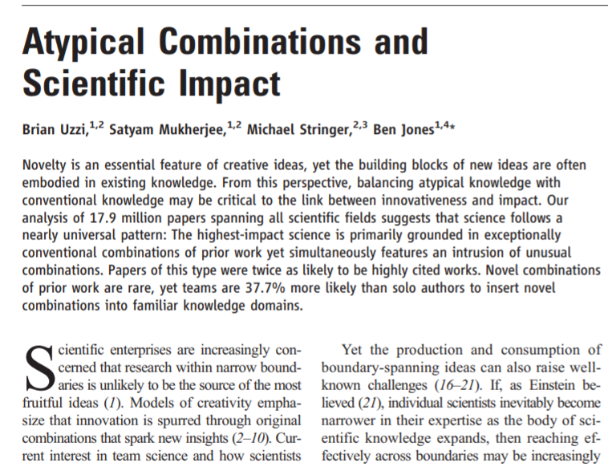

# From book chapter 2 article

## Semantic tipicality measure 

_Last edit:_ Tue Sep 21 02:33:49 PM BST 2021

---

# What are we trying to achieve?

- Appreciating the semantic tipicality of an earning conference call _vis a' vis_   
  financial analyst reports
- In more abstract terms, we'd like to measure how business leaders stick
  with key stakeholders' focus/foci of attention

---

# So what?

- From a descriptive standpoint, a tipicality measure is interesting as it 
  highlights how/to what extent the attention of business leaders change with the passing of time, or in the wake of 'meaningful events' such as exogenous shocks, competitive interactions, or regulatory changes
- In terms of statistical post-processing, a tipicality measure could be used 
  in an event study to estimate the reaction of the market _vis a' vis_ 
  'atipycal' earning conference cals
- Finally, a tipicality measure can help us to understand the fine semantic 	  
  structure of business leaders' communication (e.g., by revealing the most
  'atypical' sentences)

---

# Semantic tipicality measure: Uzzi et al. (2013)

---

# Semantic tipicality measure: Uzzi et al. (2013)

In our case, we measure semantic similarity at the sentence level.

- First, we represent financial analyst reports as bag of words (via TFIDF)
- Then, we count the number of times two words co-occur in the same sentence
  (we use z-scores; the higher a z-score, the more typical the pair of words)
- Finally, we model each sentence included in a conference call transcript
  as sets of word pairs. A sentence with ten words is associated with a vector
  containing 45 z-scores (n*(n-1)/2)

---

# Empirical pattern 

The 95 companies included in the dataset exhibit a common pattern:

- semantic atipicality increases in the aftermath of the 2008 financial crisis
- then, it decreases from 2014/2015 onwards (there's substantial inter-firm
  heterogeneity though)